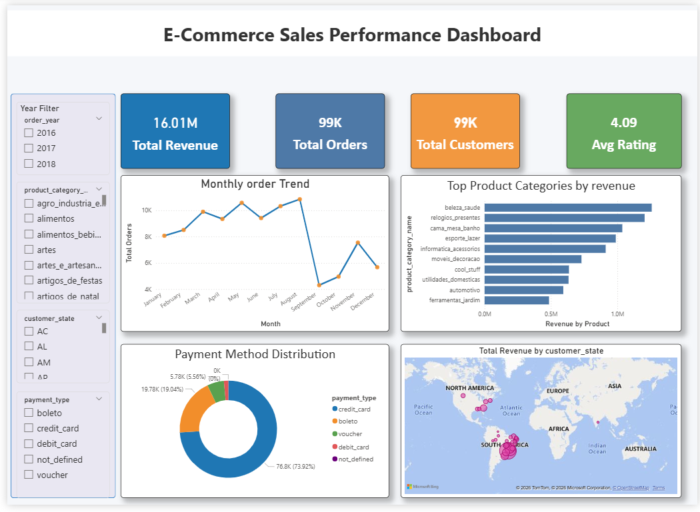

### E-Commerce Sales Analysis Dashboard

## Project Overview
This project presents an end-to-end data analytics workflow using Python, SQL, and Power BI to       analyze an e-commerce dataset. The goal is to understand sales performance, product trends, customer behavior, and payment patterns and present the findings through an interactive dashboard.

The final result is a Power BI dashboard that enables users to explore revenue trends, top-performing product categories, and geographic sales distribution.

---

# Dataset
The dataset used in this project is the Brazilian E-Commerce Public Dataset by Olist, which contains information about customer orders between 2016 and 2018.

## Main Tables
- Customers
- Orders
- Order Items
- Products
- Payments
- Reviews

These tables provide insights about customer locations, orders, products, payment methods, and customer feedback.

---

# Tools & Technologies
The following tools were used in this project:

| Tool            | Purpose |
|-----------------|---------------------------------
| Python          | Data cleaning and preprocessing |
| MySQL           | Data analysis and SQL queries |
| Power BI        | Dashboard development and visualization |
| GitHub          | Project documentation and version control |

---

# Data Cleaning (Python)
Data cleaning was performed using Python (Pandas) to ensure accurate analysis.

## Key Cleaning Steps
- Handling missing values
- Removing duplicate records
- Converting date columns to datetime format
- Standardizing product categories
- Creating new columns such as order year, order month, and delivery days.

The cleaned data was exported and used for further analysis in SQL and Power BI.

---

# SQL Analysis
SQL queries were used to extract insights from the dataset.

## Key SQL Analyses
- Total Revenue
- Total Orders
- Monthly Sales Trend
- Top Product Categories by Revenue
- Sales by State
- Payment Method Distribution
- Average Customer Rating

These queries helped answer key business questions and supported the dashboard design.

---

#  Power BI Dashboard

An interactive Power BI dashboard was created to visualize the analysis results.

## KPI Metrics
- Total Revenue
- Total Orders
- Total Customers
- Average Rating

## Dashboard Visualizations
- Monthly Order Trend
- Top Product Categories by Revenue
- Payment Method Distribution
- Revenue by State (Map Visualization)

## Interactive Filters
Users can filter the dashboard by:
- Year
- Product Category
- Customer State
- Payment Type

This allows dynamic exploration of the dataset.

---

#  Key Insights
Some important insights from the analysis include:

- The platform generated approximately $16M in revenue.
- Beauty & Health, Watches & Gifts, and Bed & Bath products are the top-performing product categories.
- Credit card payments dominate transactions, accounting for the majority of purchases.
- The average customer rating is 4.09, indicating generally positive customer satisfaction.
- Sales are concentrated in specific states, highlighting potential regional markets.

---

# 💡 Business Recommendations
Based on the analysis, the following recommendations were identified:

1. Increase marketing campaigns for high-performing product categories.
2. Improve delivery logistics in high-sales regions.
3. Encourage alternative payment methods through promotions or discounts.
4. Use customer feedback to identify product improvement opportunities.
5. Implement personalized product recommendations to increase repeat purchases.

---

#  Project Structure
Ecommerce-Sales-Analysis
│
├── Dataset
│
├── Data_Cleaning
│ data_documentation.pdf
│
├── SQL
│ analysis_queries.sql
│ sql_analysis_report.pdf
│
├── PowerBI
│ sales_dashboard.pbix
│
├── Insights
│ final_insights_and_recommendations.pdf
│
└── README.md

---

# 🖼 Dashboard Preview

---

#  Conclusion
This project demonstrates a complete data analytics pipeline, including data cleaning, SQL analysis, and interactive dashboard development.

The dashboard provides valuable insights into sales performance, product trends, customer behavior, and payment preferences, enabling data-driven decision-making.

---

Author
Muhammed Midhilaj

